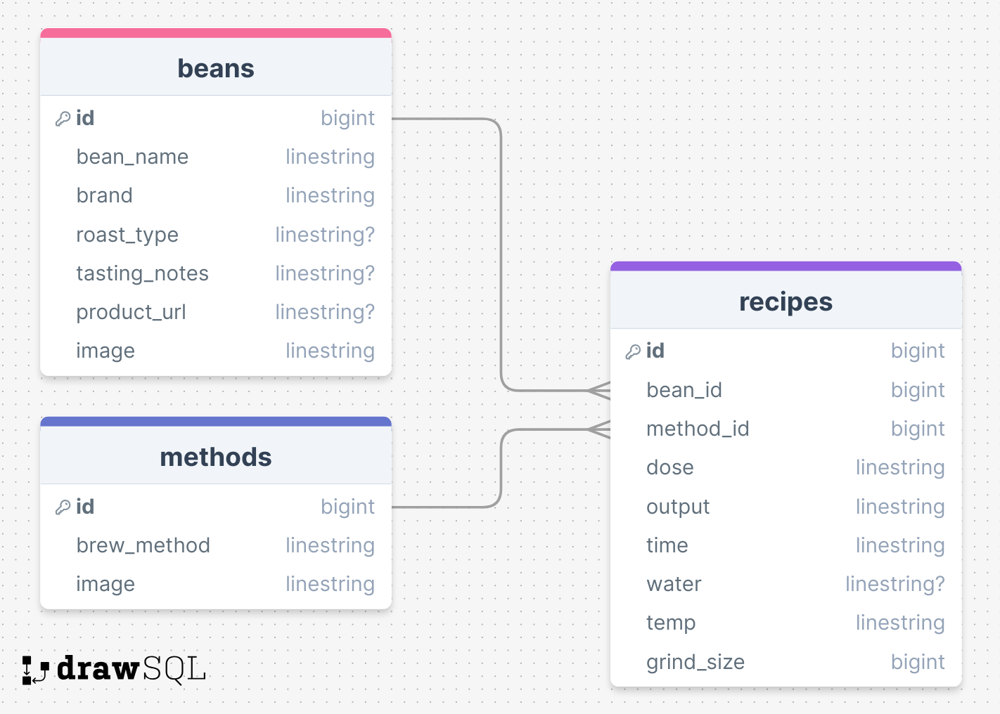

# Project Title

Home Barista

## Overview

Home Barista is an app designed to improve the home barista's dialing process by allowing you to record brew parameters for different coffee beans and also leave notes to improve your next brew.

### Problem

Whenever switching to a different coffee bean, you would need to dial in the new bean, often discarding the first couple of shots before reaching a balanced cup of coffee. Home barista allows you to record the brew parameters for different beans, so that the next time you brew with the same bean you might save some time, coffee, and frustration. It also allows you to build recipes for different beans and brew techniques so you don't have to try to remember what you did the last time to reach that perfect cup.

### User Profile

Any coffee lover who brews their own coffee.

### Features

- Add different coffee beans by name and brand. Optionally include roast style (light, medium, dark), tasting notes, and product URL that will link to respective product pages to make repurchasing easier.
- Upload photo of coffee bean when adding new bean to improve home page aesthetic.
- View different brewing techniques (espresso, Aeropress, pourover, moka pot, french press, siphon, cold brew); each method will have its own recipe template based on required parameters.
- Add recipes based on coffee bean and brew technique used. Lock and unlock (still dialing) recipes to allow edits. On dial mode, use note taking feature to record taste and previous brew settings to make improving the next cup easier. Lock recipe to minimize page content to only display perfect brew recipe.

## Implementation

### Tech Stack

- React.js
- Node.js
- MySQl
- Client libraries
  - react-router-dom
  - sass
  - axios
- Server libraries
  - knex
  - express
  - cors
  - dotenv

### APIs

No external APIs at this point.

### Sitemap

User home page - show available coffee beans and brew equipment, contain buttons to add beans.

Coffee bean page - show brew methods with recorded recipes and button to add another method.

Recipe page - toggle dial to edit or lock recipe

Add new recipe page - similar to edit page but has empty input fields

### Mockups


### Data



### Endpoints

**GET /coffee**

- Get all coffee beans

Response:

```
[
  {
    "id": 1,
    "name": "Espresso Blend",
    "brand": "Hale",
    "roast": "medium",
    "tasting_notes": "chocolate, berries"
    "product_url": "https://www.halecoffee.com/products/hale-espresso",
    "image": "https://www.halecoffee.com/cdn/shop/files/Haleespressowhite.jpg?v=1709696236"
  },
  ...
]
```

**GET /method**

- Get all methods

```
Response:
[
  {
    "method": "Espresso",
    "image": "https://assets.breville.com/cdn-cgi/image/width=1300,format=auto/Dynamic_Bundle/US/BES870XL_Transparent_1300x1300.png?pdp"
  },
  {
    "method": "Pour Over",
    "image": "https://assets.breville.com/cdn-cgi/image/width=1300,format=auto/Dynamic_Bundle/US/BES870XL_Transparent_1300x1300.png?pdp"
  }
  ...
]
```

**GET /coffee/:id/method**

- Get all methods for single bean

Parameters:

- coffee.id

```
[
  {
    "method": "Espresso",
    "image": "https://assets.breville.com/cdn-cgi/image/width=1300,format=auto/Dynamic_Bundle/US/BES870XL_Transparent_1300x1300.png?pdp"
  },
  {
    "method": "Pour Over",
    "image": "https://assets.breville.com/cdn-cgi/image/width=1300,format=auto/Dynamic_Bundle/US/BES870XL_Transparent_1300x1300.png?pdp"
  }
  ...
]
```

**GET /coffee/:id/method/:id/recipe/:id**

- Get recipe

Parameters:

- coffee.id
- method.id

```
{
  "id": 1,
  "method": "Espresso",
  "dose": "18g",
  "output": "36g",
  "time": "28s",
  "temp": "96C",
  "water": "",
  "grind_size": 10
}
```

**PUT /coffee/:id/method/:id/recipe/:id**

- Edit recipe

Parameters:

- coffee.id
- method.id
- req.body

```
{
  "id": 1,
  "method": "Espresso",
  "dose": "18g",
  "output": "36g",
  "time": "28s",
  "temp": "96C",
  "water": "",
  "grind_size": 10
}
```

**DELETE /coffee/:id/method/:id/recipe/:id**

- Delete recipe

Parameters:

- coffee.id
- method.id

**POST /coffee/:id/method/:id/recipe**

- Add new recipe

Parameters:

- coffee.id
- method.id

```
{
  "id": 1,
  "method": "Espresso",
  "dose": "18g",
  "output": "36g",
  "time": "28s",
  "temp": "96C",
  "water": "",
  "grind_size": 10
}
```

**POST /coffee**

- Add new coffee bean

```
{
  "id": 1,
  "name": "Espresso Blend",
  "brand": "Hale",
  "roast": "medium",
  "tasting_notes": "chocolate, berries"
  "product_url": "https://www.halecoffee.com/products/hale-espresso",
  "image": "https://www.halecoffee.com/cdn/shop/files/Haleespressowhite.jpg?v=1709696236"
}
```

**DELETE /coffee/:id**

- Delete coffee bean

### Auth

Having users and authentication will be a nice-to-have.

## Roadmap

Sprint 1 (TIME ~ 2 weeks):

- Create client
- Create server
- Create migrations
- Create sample coffee and recipe data
- Build API endpoints
- Create home page that gets coffee data and gets method data from server
- Create coffee page that gets single coffee data and related recipes/methods
- Create recipe page that gets single recipe and has edit feature
- Create add method and add recipe pages
- Create add new coffee bean page
- Implement delete function for recipes and beans

Sprint 2 (Time permitting):

- Create landing page with sign/up and login
- Store user data and implement authentication with JWT token
- Append API requests with JWT token

Sprint 3:

- Deploy application

## Nice-to-haves

- Landing page with login/signup
- Have users information stored and implement authentication
- Timer that user can use when brewing
- Make methods non-static: allow users to choose which methods they have on the home page based on the equipment that they own. Allow photo upload to change static equipment photos. Create Add method feature to achieve this.
- Deployment
